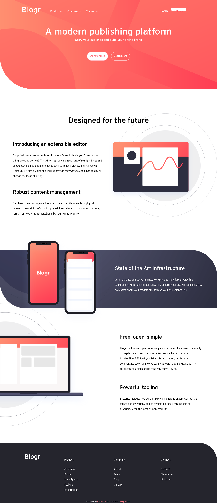

# Frontend Mentor - Blogr landing page solution

This is a solution to the [Blogr landing page challenge on Frontend Mentor](https://www.frontendmentor.io/challenges/blogr-landing-page-EX2RLAApP). Frontend Mentor challenges help you improve your coding skills by building realistic projects. 

## Table of contents

- [Overview](#overview)
  - [The challenge](#the-challenge)
  - [Screenshot](#ScreenshoT)
  - [Links](#links)
- [My process](#my-process)
  - [Built with](#built-with)
  - [What I learned](#what-i-learned)
  - [Continued development](#continued-development)
  - [Useful resources](#useful-resources)
- [Author](#author)
- [Acknowledgments](#acknowledgments)


## Overview

### The challenge

Users should be able to:

- View the optimal layout for the site depending on their device's screen size
- See hover states for all interactive elements on the page

### Screenshot


### Links

- You can see the result [here](https://macluiggy.github.io/blogrLandingPage)

## My process


### Built with

- Semantic HTML5 markup
- CSS custom properties
- Flexbox
- Mobile-first workflow
- media queries
- JavaScript

### What I learned
In this project I learned to adapt a page in responsive we design so an user can see the web page in a mobile device. I also learned to implement JavaScript so when the width of the page is small enough the image change to its corresponding mobile version, I did this as follows:

```js
var illustratorEditor = document.querySelector('#illustration-editor');// selecciona la imagen
    if (window.innerWidth < 500) { // si el ancho de la pantalla es menor que el valor
        illustratorEditor.src = './images/illustration-editor-mobile.svg';// cambia la imagen
    }

    //codigo para el main3
    var illustrationLaptop = document.querySelector('#illustration-laptop');

    if (window.innerWidth < 500) {
        illustrationLaptop.src = './images/illustration-laptop-mobile.svg';
    }
```

### Continued development

I really like the way CSS flexbox helps to manipulate the display of the elements of a container, surely I'll continue using this technique. In this project this is the first time I used media queries, so I'll continue making project to solidify its concepts.


### Useful resources

- [w3schools](https://www.w3schools.com/howto/howto_css_menu_icon.asp) - w3schools helped me with the hamburger navbar in the mobile version to hide and show the content of the navigation bar
- [stackoverflow](https://stackoverflow.com/) - Also stackoverflow helped me solve small doubts

## Author

- Frontend Mentor - [@macluiggy](https://www.frontendmentor.io/profile/macluiggy)
- LinkedIn - (https://www.linkedin.com/in/luiggy-macias-402696155/)

